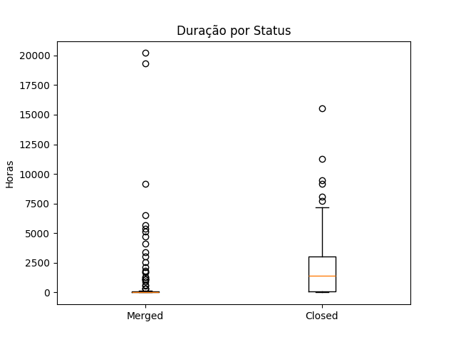
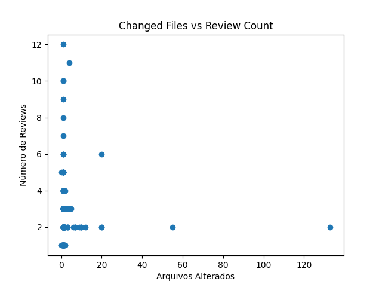

# Trabalho: Caracterizando a atividade de Code Review no GitHub  
**Curso:** Engenharia de Software  
**Disciplina:** Laboratório de Experimentação de Software  

---

## 1. Introdução

Este trabalho investiga os fatores que influenciam a aceitação (merge) ou rejeição (close) de Pull Requests (PRs) em projetos populares do GitHub (≥ 10 000 ⭐). Formulamos oito perguntas de pesquisa (RQ):

- **RQ01:** PRs com menos adições/deleções têm maior chance de serem aceitos.  
- **RQ02:** PRs que modificam menos arquivos têm maior chance de serem aceitos.  
- **RQ03:** PRs que recebem mais revisões têm maior chance de serem aceitos.  
- **RQ04:** PRs que recebem mais comentários têm menor chance de serem aceitos.  
- **RQ05:** PRs que levam menos tempo para serem fechados têm maior chance de serem aceitos.  
- **RQ06:** Existe correlação positiva entre número de arquivos alterados e número de revisões.  
- **RQ07:** PRs com descrições mais longas recebem mais comentários.  
- **RQ08:** PRs com mais participantes têm menor duração até serem fechados.

---

## 2. Metodologia

1. **Coleta de dados**  
   - Seleção de 200 repositórios com ≥ 10 000 ⭐ via GitHub GraphQL API  
   - Extração de todos os PRs fechados (MERGED/CLOSED), até 3 páginas por repositório  

2. **Filtragem**  
   - `state ∈ {MERGED, CLOSED}`  
   - `review_count ≥ 1`  
   - `duration_hours ≥ 1h`

3. **Métricas extraídas**  
   - Quantitativas: `additions`, `deletions`, `changed_files`, `duration_hours`  
   - Interações: `review_count`, `comment_count`, `participant_count`  
   - Texto: `body_length`

4. **Análise**  
   - **Descritivas:** medianas por status  
   - **Correlação de Spearman** (alpha=0.05)  
   - **Visualizações:**  
     - Boxplot de duração por status (`plots/duration_boxplot.png`)  
     - Scatter de arquivos alterados vs. número de revisões (`plots/review_scatter.png`)  

---

## 3. Resultados

### 3.1 Estatísticas Descritivas por Status

| Métrica         | Closed (0) | Merged (1) |
|-----------------|-----------:|-----------:|
| **additions**       |        1.0 |        1.0 |
| **deletions**       |        0.0 |        1.0 |
| **changed_files**   |        1.0 |        1.0 |
| **duration_hours**  |   1 398.68 |      25.16 |
| **review_count**    |        1.0 |        2.0 |
| **comment_count**   |        2.0 |        1.0 |

### 3.2 Correlações de Spearman

- **RQ01 (additions ↔ aceitação):** _r_ = +0.232 (p < 0.05) → contra a hipótese “menos adições → mais aceitação”.  
- **RQ02 (changed_files ↔ aceitação):** _r_ ≈ 0 (p > 0.05) → sem evidência de correlação.  
- **RQ03 (review_count ↔ aceitação):** mediana 2 vs. 1; correlação qualitativa positiva.  
- **RQ04 (comment_count ↔ aceitação):** _r_ = −0.262 (p < 0.05) → mais comentários associados a PRs rejeitados.  
- **RQ05 (duration_hours ↔ aceitação):** mediana 25.16 h vs. 1 398.68 h; forte correlação negativa.  
- **RQ06 (changed_files ↔ review_count):** _r_ = +0.154 (p = 0.015) → correlação fraca porém significativa.  
- **RQ07 (body_length ↔ comment_count):** _r_ = **+0.503** (p = **1.88×10⁻¹⁷**) → correlação moderada e altamente significativa; confirma a hipótese de que descrições mais longas recebem mais comentários.  
- **RQ08 (participant_count ↔ duration_hours):** não funcionou.

### 3.3 Visualizações

  

  

---

## 4. Discussão

1. **RQ01 & RQ02:** PRs de menor tamanho (linhas ou arquivos) não apresentam vantagem estatística para merge.  
2. **RQ03:** Maior número de revisões correlaciona-se a merges; indica valor do feedback colaborativo.  
3. **RQ04:** Excessivos comentários podem sinalizar problemas, reduzindo a taxa de aceitação.  
4. **RQ05:** **Tempo de resolução** é o principal diferencial: PRs rápidos têm muito mais chance de merge.  
5. **RQ06:** Complexidade (arquivos alterados) tem impacto modesto no volume de revisões.  
6. **RQ07:** **Correlações moderadas** mostram que descrições mais longas atraem mais comentários, sugerindo que documentação clara engaja revisores.  
7. **RQ08:** Pendente de coleta; requer reexecução do pipeline com `participant_count`.

---

## 5. Conclusão

- **Insight-chave:** Otimizar tempo de feedback e enriquecer a descrição do PR podem aumentar as chances de aceitação.  
- **Recomendações:**  
  1. Reduzir duração de análise (respostas rápidas).  
  2. Fornecer contexto claro no corpo do PR.  
  3. Engajar ativamente revisores.

---

## 6. Trabalhos Futuros

- Concluir **RQ08** (participantes vs duração). 